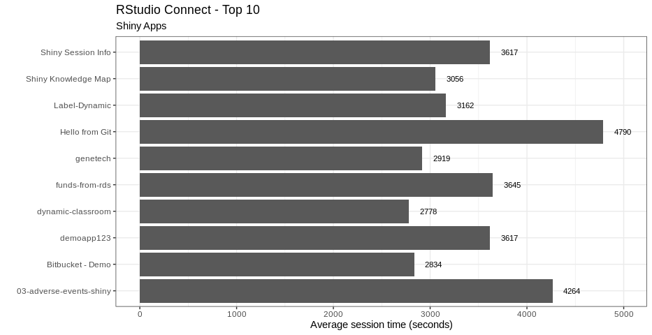

# RStudio Connect Usage Report

This R Markdown report can be published as-is to your RStudio Connect server or 
used as a starting point for your own analysis. You can schedule the report and 
distribute it via email (the email will include inline graphics!)

Sample Report: http://colorado.rstudio.com/rsc/usage

<center></center>

The report is generated using the [RStudio Connect Server API](https://docs.rstudio.com/connect/api). The `helpers.R` file contains example code for querying the various API endpoints. The API and data collection are both available as of RStudio Connect 1.7.0. The API contains data to help answer questions like:

- What content is most visited?
- Who is visiting my content?
- What reports are most common?
- Has viewership increased over time?
- Did my CEO actually visit this app?

**A data science team's time is precious, this data will help you focus and justify your efforts.**

The report uses the environment variables `RSTUDIO_CONNECT_SERVER` and `RSTUDIO_CONNECT_API_KEY` to collect the data. To limit the results to a single publisher, use a publisher API key.

### Common Questions

- Could this be a shiny app instead of a report? Of course! Let us know what you come up with.
- Can I use the API from another language besides R? Absolutely, the API includes a spec to get you started.
- Will you provide an R client for accessing the API? Please start a topic on [RStudio Community](https://community.rstudio.com/c/r-admin) (in the R Admins section) if this sounds interesting.
- What is the `manifest.json` file? This file aids in programmatic deployments, a new RStudio Connect feature.

## Basic example

The following code should work as-is if copied into your R session.  You just need to replace the server name, and have your API key ready.  

If the file does not exist, `helpers.R` will be copied to your workspace from this repository. After source the `helper.R` file, the code below will load the server and API key.  Lastly, it will use the `get_shiny_usage()` function to pull the latest activity of the Shiny apps you are allowed to see within your server, and then `clean_data()` is mainly used to calculate the length of each session. 

```r
library(ggplot2)
library(dplyr)

# Bring the needed functions into your project by copying the helper.R file
if(!file.exists("helpers.R")) {
  helpers <- "https://raw.githubusercontent.com/sol-eng/connect-usage/master/helpers.R"
  writeLines(readLines(helpers), "helpers.R")
}
source("helpers.R")

## ACTION REQUIRED: Change the server URL below to your server's URL
Sys.setenv("RSTUDIO_CONNECT_SERVER"  = "https://connect.example.com/rsc") 
## ACTION REQUIRED: Make sure to have your API key ready
Sys.setenv("RSTUDIO_CONNECT_API_KEY" = rstudioapi::askForPassword("Enter Connect Token:")) 

# Get and clean the Shiny usage data
shiny_rsc <- get_shiny_usage() %>% 
  clean_data()

glimpse(shiny_rsc)
```
```
## Observations: 1,343
## Variables: 6
## $ content_guid     <chr> "7ffb6265-a426-483b-84dd-29b3ffbe86da", "f9f1d131-7c57-4f80-81d8-afa…
## $ user_guid        <chr> "anonymous", "anonymous", "anonymous", "anonymous", "anonymous", "an…
## $ started          <dttm> 2019-07-28 19:40:21, 2019-07-28 21:19:06, 2019-07-28 22:23:36, 2019…
## $ ended            <dttm> 2019-07-28 20:40:41, 2019-07-28 21:20:11, 2019-07-28 22:23:54, 2019…
## $ data_version     <list> [1, 1, 1, 1, 1, 1, 1, 1, 1, 1, 1, 1, 1, 1, 1, 1, 1, 1, 1, 1, 1, 1, …
## $ session_duration <drtn> 3620 secs, 65 secs, 18 secs, 18 secs, 3617 secs, 65 secs, 90 secs, …
```

The identifiers used for the content in RStudio Connect are GUIDs.  In order to get their title, we need to use the `get_content_name()` function.  This function returns only one GUID at a time, so `purrr`'s `map_dfr()` is used to iterate through all of the unique GUIDs in order to get every Shiny app's title.

```r
# Get the title of each Shiny app
shiny_rsc_names <- shiny_rsc %>%
  count(content_guid) %>% 
  pull(content_guid) %>%
  purrr::map_dfr(
    ~tibble(content_guid = .x, content_name = get_content_name(.x))
    )

glimpse(shiny_rsc_names)
```
```
## Observations: 122
## Variables: 2
## $ content_guid <chr> "0076bbb3-429e-4f99-9f85-674b1f8ea3b7", "030de800-7c9f-4d18-a5c4-c87b79a…
## $ content_name <chr> "Bitbucket - Demo", "Pro Admin Training 7-1 exercise: Install RSPM", "Sa…
```

The new `shiny_rsc_names` table, and the `shiny_rsc` can be joined to return the "user readable" title name. Using standard `dplyr` and `ggplot2` functions, we can now determine things such as the top 10 apps based on how long their average sessions are.

```r
# Calculate the average session duration and sort
app_sessions <- shiny_rsc %>%
  group_by(content_guid) %>%
  summarise(avg_session = mean(session_duration)) %>%
  ungroup() %>%
  arrange(desc(avg_session)) %>%
  head(10) %>%
  inner_join(shiny_rsc_names, by = "content_guid") 
  
# Plot the top 10 used content
app_sessions %>%
  ggplot(aes(content_name, avg_session)) +
  geom_col() +
  geom_text(aes(y = avg_session + 200, label = round(avg_session)), size = 3) +
  coord_flip() +
  theme_bw() +
  labs(
    title = "RStudio Connect - Top 10", 
    subtitle = "Shiny Apps", 
    x = "", 
    y = "Average session time (seconds)"
    )
```

<center></center>

Learn more about programmatic deployments, calling the server API, and custom emails [here](https://docs.rstudio.com/user).
