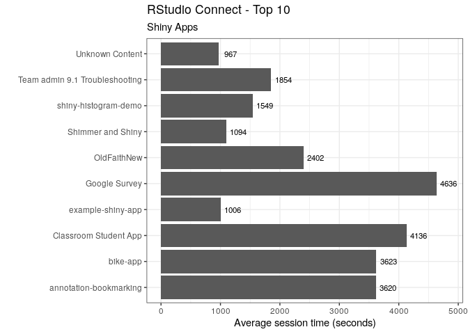

# RStudio Connect Usage Data

This repository illustrates several examples for getting started with
the RStudio Connect usage data. The examples:

-   [./examples/last_30_days](./examples/last_30_days)
-   [./examples/connectAnalytics](./examples/connectAnalytics)
-   [./examples/connectViz](./examples/connectViz)

The examples are generated using the [RStudio Connect Server
API](https://docs.rstudio.com/connect/api). The API and data collection
are both available as of RStudio Connect 1.7.0. The API contains data to
help answer questions like:

-   What content is most visited?
-   Who is visiting my content?
-   What reports are most common?
-   Has viewership increased over time?
-   Did my CEO actually visit this app?

**A data science team’s time is precious, this data will help you focus
and justify your efforts.**

## Basic example

The following code should work as-is if copied into your R session. NOTE
that it uses the [`connectapi`](https://github.com/rstudio/connectapi)
package, which can be installed from GitHub with
`remotes::install_github("rstudio/connectapi")`. You just need to
replace the server name, and have your API key ready.

``` r
## ACTION REQUIRED: Change the server URL below to your server's URL
Sys.setenv("CONNECT_SERVER"  = "https://connect.example.com/rsc") 
## ACTION REQUIRED: Make sure to have your API key ready
Sys.setenv("CONNECT_API_KEY" = rstudioapi::askForPassword("Enter Connect Token:")) 
```

This will use the `get_usage_shiny()` function to pull the latest
activity of the Shiny apps you are allowed to see within your server.

``` r
library(ggplot2)
library(dplyr)
library(connectapi)

client <- connect()

# Get and clean the Shiny usage data
shiny_rsc <- get_usage_shiny(
  client,
  from = lubridate::today() - lubridate::ddays(7), 
  limit = Inf
  ) %>%
  filter(!is.na(ended)) %>%
  mutate(session_duration = ended - started)

glimpse(shiny_rsc)
```

    ## Rows: 336
    ## Columns: 6
    ## $ content_guid     <chr> "dad2ac84-2450-4275-b26e-8e0d9d741100", "6f69884b-562…
    ## $ user_guid        <chr> NA, NA, NA, NA, NA, NA, NA, "7defcf1b-69f6-4bc5-8b52-…
    ## $ started          <dttm> 2022-02-23 01:54:12, 2022-02-23 03:17:46, 2022-02-23…
    ## $ ended            <dttm> 2022-02-23 01:54:45, 2022-02-23 03:19:25, 2022-02-23…
    ## $ data_version     <int> 1, 1, 1, 1, 1, 1, 1, 1, 1, 1, 1, 1, 1, 1, 1, 1, 1, 1,…
    ## $ session_duration <drtn> 33 secs, 99 secs, 3685 secs, 61 secs, 59 secs, 51 se…

The identifiers used for the content in RStudio Connect are GUIDs. We
can retrieve content names using the API. The API handles only one GUID
at a time, so `purrr`’s `map_dfr()` is used to iterate through all of
the unique GUIDs in order to get every Shiny app’s title.

``` r
# Get the title of each Shiny app
shiny_rsc_titles <- shiny_rsc %>%
  count(content_guid) %>% 
  pull(content_guid) %>%
  purrr::map_dfr(
    ~tibble(content_guid = .x, content_name = content_title(client, .x))
    )

glimpse(shiny_rsc_titles)
```

    ## Rows: 40
    ## Columns: 2
    ## $ content_guid <chr> "0287f7d9-4d55-4813-8852-680f54beaad1", "06484fbb-f686-42…
    ## $ content_name <chr> "Example Palmer Penguins Shiny Dashboard", "Classroom Stu…

The new `shiny_rsc_titles` table, and the `shiny_rsc` can be joined to
return the “user readable” title. Using standard `dplyr` and `ggplot2`
functions, we can now determine things such as the top 10 apps based on
how long their average sessions are.

``` r
# Calculate the average session duration and sort
app_sessions <- shiny_rsc %>%
  group_by(content_guid) %>%
  summarise(avg_session = mean(session_duration)) %>%
  ungroup() %>%
  arrange(desc(avg_session)) %>%
  head(10) %>%
  inner_join(shiny_rsc_titles, by = "content_guid") 
  
# Plot the top 10 used content
app_sessions %>%
  ggplot(aes(content_name, avg_session)) +
  geom_col() +
  scale_y_continuous() +
  geom_text(aes(y = (avg_session + 200), label = round(avg_session)), size = 3) +
  coord_flip() +
  theme_bw() +
  labs(
    title = "RStudio Connect - Top 10", 
    subtitle = "Shiny Apps", 
    x = "", 
    y = "Average session time (seconds)"
    )
```

<!-- -->

Learn more about programmatic deployments, calling the server API, and
custom emails [here](https://docs.rstudio.com/user).
