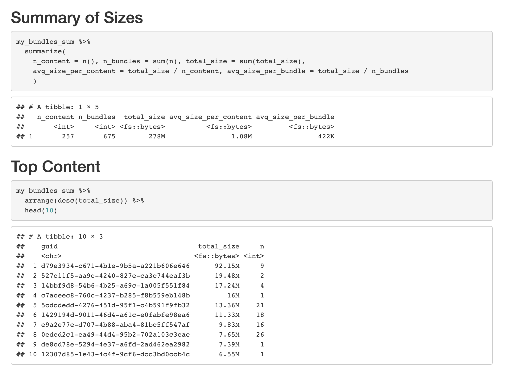

# Disk Size Reporting

Inside of RStudio Connect, it is often desirable for adiministrators to review disk usage of various applications.

This example report shows how this can be done today by looking at bundle sizes. We would like to eventually do
similar for Jobs and saved Job Output.

Some caveats: 

- This only works for content you are a "collaborator" on. In this example, we
  only retrieve size data about the author's content (because it is easier to
  filter on). `get_user_permission()` and `get_group_permission()` can be used to
  figure out what content you are a collaborator on.
- As an administrator, another approach is to "add yourself to content,"
  "retrieve bundle data", then "remove yourself again". This will allow you to
  retrieve all bundle data, but will take longer and will add many audit log
  entries.
- Further, it is worth noting that this takes _a while_, because you have to iterate
  through each piece of content directly.
- We will explore improvements to the Connect access model in the future to make such
  reporting easier.

