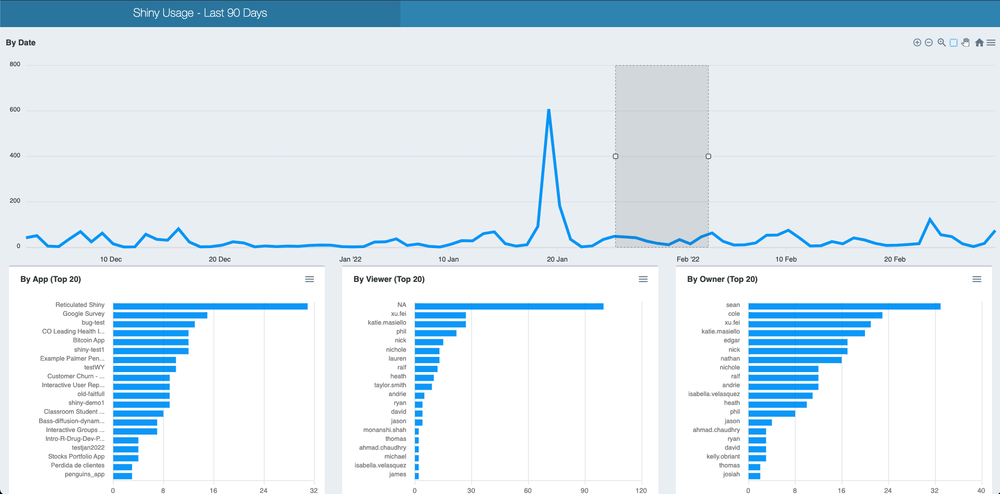

# Interactive App

This application is an example using the
[`apexcharter`](https://dreamrs.github.io/apexcharter/) package to create
interactive graphics that explore pre-downloaded and aggregated instrumentation data.

For bigger servers, fetching this data real-time is costly and time-consuming,
so we fetch 90 days of data at app start-up (and use a cache so that it is only
fetched once per day).

We also use reactivity so that selecting the timeline will filter and re-render
other charts accordingly.

[Example Application Deployment](https://colorado.rstudio.com/rsc/usage-interactive/)

