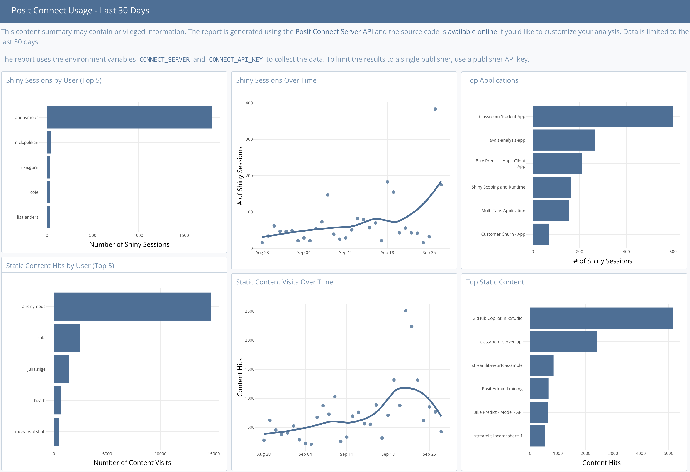

# RStudio Connect Usage Report

This R Markdown report can be published as-is to your RStudio Connect server or 
used as a starting point for your own analysis. You can schedule the report and 
distribute it via email (the email will include inline graphics!)

Sample Report: http://colorado.rstudio.com/rsc/usage

The report is generated using the [RStudio Connect Server
API](https://docs.rstudio.com/connect/api). The API and data collection are both
available as of RStudio Connect 1.7.0. The API contains data to help answer
questions like:

- What content is most visited?
- Who is visiting my content?
- What reports are most common?
- Has viewership increased over time?
- Did my CEO actually visit this app?

**A data science team's time is precious, this data will help you focus and justify your efforts.**

The report uses the environment variables `CONNECT_SERVER` and `CONNECT_API_KEY` to collect the data. To limit the results to a single publisher, use a publisher API key.

### Common Questions

- Could this be a shiny app instead of a report? Of course! Let us know what you come up with.
- Can I use the API from another language besides R? Absolutely, [the API
  includes a spec](https://docs.rstudio.com/connect/api) to get you started.
- Will you provide an R client for accessing the API? Yes! It is called
  [`connectapi`](https://github.com/rstudio/connectapi)
- What is the `manifest.json` file? This file aids in programmatic or git-backed deployments
- What is the funky `preflight_check` chunk at the start of the report? If the
  report is run without essential environment variables (`CONNECT_SERVER` and
  `CONNECT_API_KEY`), this chunk will return a clear error message promptly rather than
  waiting for the report to exit weirdly. It is there to protect you!

