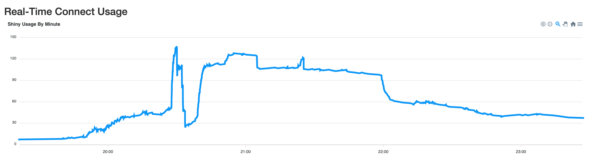

# Real-Time Usage Data

This report queries the RStudio Connect Server API regularly (using a
configurable interval) to fetch the latest usage data. This shows an interesting
"real-time" view of app and content usage on the server.

To configure, use these environment variables:
- `CONNECT_SERVER` / `CONNECT_API_KEY` - to retrieve the data. This is set by default on RStudio Connect
- `HOURS_BACK` - At app startup, how far back will data start being aggregated?
  This is the "baseline" for how much usage is currently present. Default: 4 (4 hours)
- `FETCH_DELAY_MS` - how long (in milliseconds) should the app wait before fetching new data? Default: 60000 (1 minute)

